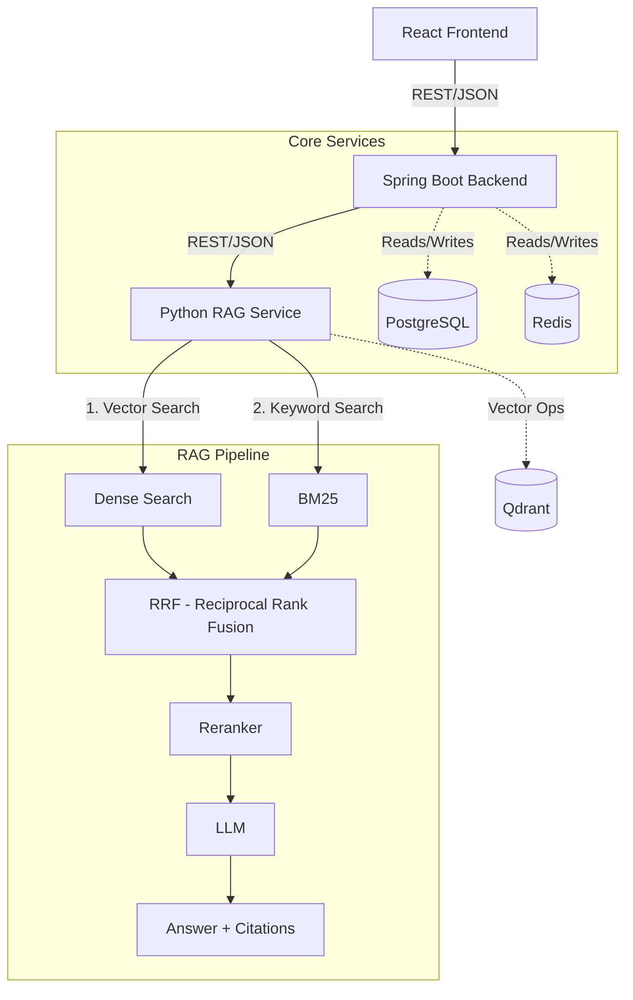

# System Architecture

## System Overview
DocAnalyser is a microservices-based AI/RAG application designed for intelligent document analysis. It separates user-facing business logic from heavy AI and vector processing.

## Architecture Diagram

## Component Responsibilities

### React Frontend
- Renders the User Interface.
- Handles user interactions.
- Displays answers and citations to the user.

### Spring Boot Backend
- Main API Gateway.
- Application and business logic.
- Authentication and authorization boundary.
- Request validation.
- Integration boundary for PostgreSQL and Redis.
- Orchestrates communication with the Python RAG service.

### Python RAG Service
- Document ingestion pipeline.
- Text processing and chunking.
- Embeddings generation.
- Hybrid Retrieval (Dense + BM25).
- Reciprocal Rank Fusion (RRF) and Reranking.
- Context construction and LLM interaction.
- Citation generation.

### Databases
- **PostgreSQL**: Relational application data and document metadata.
- **Qdrant**: Vector storage and similarity search.
- **Redis**: Caching and future session/application state.

## Request Flow
1. User submits a query via React UI.
2. Spring Boot validates the request, checks auth, and forwards the query to the Python RAG Service.
3. Python RAG Service processes the query through the retrieval pipeline, asks the LLM, and returns the answer with citations.
4. Spring Boot returns the structured response to the React UI.
